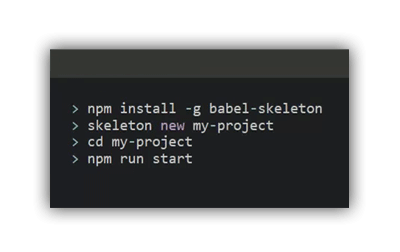
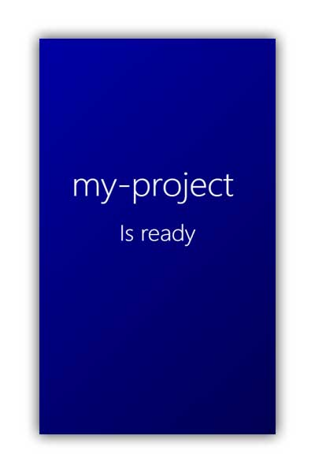
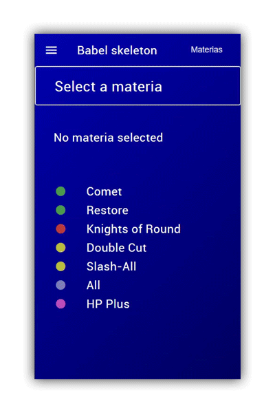
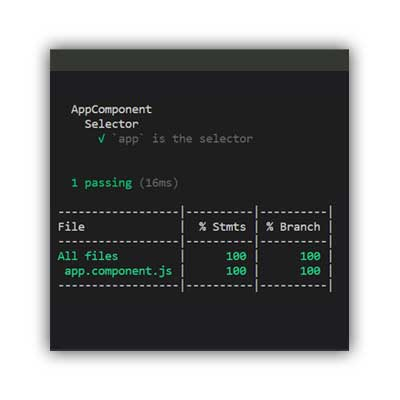

#  💀 babel skeleton


**Build modern JavaScript with productive environment**

[](https://travis-ci.org/seeren/babel-skeleton) [](https://coveralls.io/github/seeren/babel-skeleton?branch=master)
[](https://www.npmjs.com/package/babel-skeleton)
[](https://www.npmjs.com/package/babel-skeleton)

This package is a starter for deal with modern JavaScript in a productive environment. You can use this starter for bootstrap a JavaScript hybrid-app and the environment of development for watch, compile and test source code with continuous integration.

[`Babel`](https://babeljs.io/) [`BrowserSync`](https://browsersync.io/)  [`Chai`](https://www.chaijs.com/) [`Cordova`](https://cordova.apache.org/) [`Coveralls`](https://coveralls.io/) [`HtmlImport`](https://www.npmjs.com/package/babel-plugin-transform-html-import-to-string) [`Istanbul`](https://istanbul.js.org/)  [`Jsdom`](https://www.npmjs.com/package/jsdom)  [`Mocha`](https://mochajs.org/) [`NodeSass`](https://www.npmjs.com/package/node-sass) [`Sinon`](https://sinonjs.org/) [`Travis`](https://travis-ci.org/) [`Webpack`](https://webpack.js.org/)

**Table of content**
* [Installation](#installation)
* [Development](#development)
* [Integration](#integration)
* [Scripts](#scripts)
* [CLI](#cli)

<a id="installation"></a>
## 📦 Installation


Install with [npm](https://www.npmjs.com/package/babel-skeleton).
```bash
npm install -g babel-skeleton
```
Create a new application.
```bash
skeleton new my-project
```
Move the current directory.
```bash
cd my-project
```

### 💻 Web browser
Run the application on a Web Browser with [`Webpack`](https://webpack.js.org/) using hot reload with [`BrowserSync`](https://browsersync.io/).
```
npm run start
```

### 📱 Mobile

Install targeted platform.
```bash
npm run android:install
```
Run the application on installed and detected device.
```bash
npm run android
```
[Gradle](https://gradle.org/install/) must be installed and SDK build tool licenses must be accepted: `ANDROID_HOME/tools/bin/sdkmanager --licenses`.

<a id="development"></a>
## 👨‍💻 Development



This skeleton allow to develop from scratch with a modern syntax and this is the main goal. But component distribution and communication is provided with some extra classes as a proof of concept.

The skeleton provide `Component` for manage dynamic view, `Service` for share data with simple notification mechanism and `RouterComponent` for page navigation. [Try it](https://seeren.github.io/babel-skeleton/www/index.html) and view the [source code](https://github.com/seeren/babel-skeleton/tree/master/demo).

### 🍰 Components
You can generate components.
```bash
skeleton generate component foo
```
A component can be routed and associated to an URL with the `RouterComponent`.
```js
RouterComponent
    .add('/foo', 'foo', FooComponent)
    .run(new AppComponent)
```
Life cycle provide hooks: `onInit` when a component is routed, `onDestroy` when the component turn off, `onUpdate` when the template is updated. Components can embed childs by declaring them in the  `components` optionnal property.
```js
import { Component } from 'babel-skeleton';
import { BarComponent } from './bar/bar.component.html';
import { template } from './foo.component.html';

export class FooComponent extends Component {

    constructor() {
        super({
            selector: "foo",
            template: template,
            components: [
                new BarComponent,
            ]
        });
    }

    onInit() {
        this.title = `Hello`;
    }

}
```

#### Template
A component have a template with data binding using `es6 template strings`.
```html
<h2>${title}</h2>
```
Event handlers have direct access to component's methods, `update` is triggered if an event handler return a value.
```html
<a onclick="componentMethod()">Click</a>
```
Childs component have to be declared in the template.
```html
<bar></bar>
```

#### Style
A sass file is generated.
```css
foo { }
```

### 🚦 Routing
You can associate a `Component` to an URL using the `RouterComponent`.
```js
RouterComponent
    .add('/foo', 'foo', FooComponent)
    .add('/bar', 'bar', BarComponent)
    .add('/baz/:id', 'baz', BazComponent)
    .run(new AppComponent)
```
You can trigger components and push URL with `navigate`.
```js
RouterComponent.navigate('baz', { id: 7 });
```
####  RouterService
With the `RouterService` you can be notified when a navigation occurs. 
```js
RouterService.attach((service) => `Navigate to ${service.get().name}`);
```

### 💫 **Services**
You can generate services.
```bash
skeleton generate service baz
```
Services share data between components and can `notify` for changes.
```js
export const BazService = new class extends Service {

    constructor() {
        super();
        this.data = [];
    }

    get() {
        return this.data;
    }

    post(data){
        this.data.push(data);
        this.notify();
    }

}
```
Service can `attach` callbacks to trigger when `notify` is called.
```js
BazService.attach(service => `Notify have been called`);
```

<a id="integration"></a>
## ➰ Integration



The skeleton provide [`Travis`](https://travis-ci.org/) configuration for pass tests and push report to [`Coveralls`](https://coveralls.io/) after a build success. 

Pass the tests with [`Mocha`](https://mochajs.org/).
```bash
npm run test
```
Generate coverage with [`Istanbul`](https://istanbul.js.org/).
```bash
npm run coverage
```

<a id="scripts"></a>
## 🔖 Scripts

Following scripts allow you to use the development environment.

| Script | Description |
:---------------|:---------------|
| `npm run start` | Start to dev |
| `npm run skeleton` | Run cli |
| `npm run dev` | Run and watch |
| `npm run prod` | Optimised dev |
| `npm run build` | Bundle |
| `npm run android` | Deploy on device |
| `npm run android:build` | Bundle and deploy |
| `npm run android:install` | Install platform |
| `npm run ios` | Deploy on device |
| `npm run ios:install` | Install platform |
| `npm test` | Pass tests |
| `npm run test:coverage` | Generate report |
| `npm run test:coveralls` | Send report |

<a id="cli"></a>
## 🔖 CLI
Following commands allow you to generate features.

| Command | Description |
:---------------|:---------------|
| `skeleton new project-name` | Generate a project |
| `skeleton generate component component-name` | Generate a component |
| `skeleton generate service service-name` | Generate a service |

## 🎓 License
This project is under [MIT](LICENSE) license.