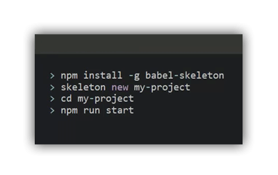
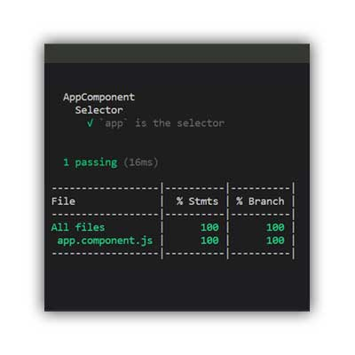
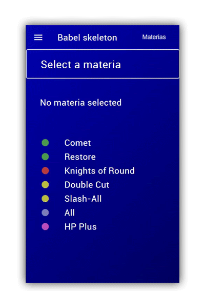

# 💀 babel skeleton



*JavaScript project starter for web and mobile with the environment of development*

[](https://travis-ci.org/seeren/babel-skeleton) [](https://coveralls.io/github/seeren/babel-skeleton?branch=master) [](https://www.npmjs.com/package/babel-skeleton) [](https://www.npmjs.com/package/babel-skeleton)

Using **webpack**, **babel**, **sass** and **cordova** you can generate a **skeleton** ready to build on web-browser and device with **continuous integration**

[`Babel`](https://babeljs.io/) [`BrowserSync`](https://browsersync.io/) [`Chai`](https://www.chaijs.com/) [`Cordova`](https://cordova.apache.org/) [`Coveralls`](https://coveralls.io/) [`HtmlImport`](https://www.npmjs.com/package/babel-plugin-transform-html-import-to-string) [`Istanbul`](https://istanbul.js.org/) [`Jsdom`](https://www.npmjs.com/package/jsdom) [`Mocha`](https://mochajs.org/) [`NodeSass`](https://www.npmjs.com/package/node-sass) [`Sinon`](https://sinonjs.org/) [`SplashScreen`](https://cordova.apache.org/docs/en/latest/reference/cordova-plugin-splashscreen/index.html)  [`Travis`](https://travis-ci.org/) [`Webpack`](https://webpack.js.org/)

* [Installation](#installation)
* [Usage](#usage)
* [Development](#development)
  * [Routing](#routing)
  * [Components](#components)
  * [Services](#services)

<a id="installation"></a>
## 📦 Installation

```bash
npm install babel-skeleton
```


___

<a id="usage"></a>
## 🕹️ Usage

`Create a project`
```bash
./node_modules/.bin/skeleton new my-project
```

```bash
cd my-project
```

### 💻 Web browser

`Run on web browser`
```
npm run start
```

### 📱 Mobile

`Install android`
```bash
npm run android:install
```


`Run on device`

```bash
npm run android:build
```

> [Gradle](https://gradle.org/install/) must be installed, device must be detected and [SDK build tools](https://androidsdkmanager.azurewebsites.net/Buildtools) must be installed and licenses must be accepted *(ANDROID_HOME/tools/bin/sdkmanager --licenses)*

### 📜 Scripts

The created project contain following scripts:

| Script | Description |
:---------------|:---------------|
| npm run start | *Start to dev* |
| npm run skeleton | *Run babel-skeleton for generate component or service* |
| npm run dev | *Build entry points and watch* |
| npm run prod | *Optimise dev* |
| npm run build | *Build* |
| npm run cordova | *Run cordova* |
| npm run res | *Run cordova-res for generate icon and splashscreen* |
| npm run android | *Deploy on device* |
| npm run android:build | *Build and deploy* |
| npm run android:install | *Install android* |
| npm test | *Pass tests* |
| npm run test:coverage | *Generate report* |
| npm run test:coveralls | *Send report to coveralls* |



> [Travis](https://travis-ci.org/) configuration is setup for pass tests and push report to [Coveralls](https://coveralls.io/) after a build success

___

<a id="development"></a>
## 👨‍💻 Development

The skeleton provide `Component` for render template, `Service` for share data with notification and `RouterComponent` for navigation and lifecycle

### 📜 Scripts

The skeleton contain following scripts:

| Script | Description |
:---------------|:---------------|
| npm run skeleton new [name] | *Generate a project* |
| npm run skeleton generate component [name] | *Generate a component* |
| npm run skeleton generate service [name] | *Generate a service* |

> [Source code](https://github.com/seeren/babel-skeleton/tree/master/demo) of the demo hosted on [GitHub Pages](https://seeren.github.io/babel-skeleton/demo/www/index.html)

___

<a id="routing"></a>
## 🚦 Routing

  

**You can associate a Component to an URL using the RouterComponent**, it will be displayed in the entry point component

*index.js*
```js
import { RouterComponent } from "babel-skeleton";

RouterComponent
  .add('/foo', 'foo', FooComponent)
  .add('/bar/:id', 'bar', BarComponent)
  .run(new AppComponent)
```

> By default the first component will be rendered, rewrited URL is allowed and matching component will be routed

*index.html*
```html
<html>
<head></head>
<body>
  <!-- Entry point component -->
  <app></app>
    <script src="./dist/index.js"></script>
</body>
</html>
```

> You can run the component you want but his selector have to be found in the index.html

*app/app.component.html*
```html
Hello app
<!-- Router component -->
<router></router>
```

> Routed component will be rendered by the RouterComponent, his tag must exists in the entry point template

### 📑 RouterComponent

```ts
/**
 * Add a route
 * 
 * @example
 * RouterComponent.add('/bar/:id', 'bar', BarComponent)
 * 
 * @param {String} path Route path
 * @param {String} name Route name
 * @param {Component} component Component class or instance
 * @returns {RouterComponent}
 * 
 * @throws {ReferenceError} for existing path or name
 */
add(path, name, component) { }

/**
 * Run the entry point after route added components
 * 
 * @example
 * RouterComponent.run(new AppComponent)
 * 
 * @param {Component} component Component instance
 * @returns {RouterComponent}
 */
run(path, name, component) { }

/**
 * Navigate to a Route
 * 
 * @example
 * RouterComponent.navigate("foo, { id: 3 })
 * 
 * @param {string} name Route name
 * @param {Object} [param] Route param
 * 
 * @throws {ReferenceError} for not found route
 */
navigate(name, param = null) { }

/**
 * Retrieve the current Route or a Route parameter value
 * 
 * @example
 * const route = RouterComponent.get()
 * const id = RouterComponent.get("id")
 * 
 * @param {String} [paramName]
 * @returns {Route|*} 
 * 
 * @throws {ReferenceError} for not found parameter name
 */
get(paramName = null) { }
```

> RouterComponent provide lifecycle hook for routed components

<a id="components"></a>
## 🍰 Components

`Generate a component`

```bash
./node_modules/.bin/skeleton generate component foo
```

Following files have been generated in *app/foo*:
* foo.component.js
* foo.component.html
* foo.component.scss

**`Component` have at least a selector and a template**

*foo.component.js*
```js
import { Component } from  'babel-skeleton';

import { template } from  './foo.component.html';

export class FooComponent extends Component {

  constructor() {
    super({ 
        selector: "foo", 
        template: template 
    });
    this.counter = 0;
  }

  increment() {
    return counter++;
  }

}
```

**`Template` use ES6 strings with access to attributes and methods**

*foo.component.html*
```html
<!-- Interpollate "counter" attribute -->
<h1>${counter}</h1>

<!-- Trigger "increment" method -->
<button onclick="increment()">Click</button>
```

> Component is updated if an event handler return a value

**`SCSS` file is generated and free to you to import it**

*foo.component.scss*
```scss
foo {}
```

**`Child Component` can be embeed**

*bar.component.js*
```js
import { Component } from  'babel-skeleton';

import { template } from  './bar.component.html';

import { BazComponent } from  './baz/baz.component.html';
import { QuxComponent } from  './qux/qux.component.html';

export class BarComponent extends Component {

  constructor() {
    super({ 
        selector: "bar", 
        template: template,
        components: [
          new BazComponent,
          new QuxComponent,
        ]
    });
  }

}
```

> Child component selector have to be found in the template

*bar.component.html*
```html
<baz></baz>
<qux></qux>
```

**`Lifecycle hooks` are triggered by the router**

*baz.component.js*
```js
import { Component } from  'babel-skeleton';
import { template } from  './baz.component.html';

export class BazComponent extends Component {

    constructor() {
        super({
            selector: "baz", 
            template: template 
        });
    }

    /**
     * Called after the component is attached
     */
    onInit() { }

    /**
     * Called after the component is displayed
     * 
     * @param {HTMLElement} element Updated element
     */
    onUpdate(element) { }

    /**
     * Called after the component is detached
     */
    onDestroy() { }

    /**
     * Called after the user trigger the back button
     * You can cancel the back navigation by returning false
     * 
     * @returns {Boolean}
     */
    onBack() { }

    /**
     * Called after the user trigger the pause button
     */
    onPause() { }

    /**
     * Called after the user trigger the resume button
     */
    onResume() { }

}
```

### 📑 Component

```js
/**
 * Update the component template
 * 
 * @example
 * this.update();
 * 
 * @returns {Component}
 * 
 * @throws {ReferenceError} for not found selector
 */
update() {
```

<a id="services"></a>
## 💫 **Services**

`Generate a service`

```bash
./node_modules/.bin/skeleton generate service baz
```

**Service share data can `notify` for changes**

*baz.service.js*
```js
export const BazService = new  class  extends  Service {

  constructor() {
    super();
    this.data = [];
  }

  post(data){
    this.data.push(data);
    this.notify();
  }

}
```

**Service can `attach` or `detach` callables to trigger when `notify` is called**

*baz.component.js*
```js
import { Component } from  'babel-skeleton';

import { template } from  './baz.component.html';

import { BazService } from  './baz.service';

export class BazComponent extends Component {

    constructor() {
        super({ selector: "baz", template: template });
        this.observer = (service) => {
          alert(`BazService has ${service.data.length} items`)
        }
    }

    onInit() { 
      BazService.attach(this.observer);
    }

    onDestroy() { 
      BazService.detach(this.observer);
    }

}
```


### 📑 Service

```js

/**
 * Attach a callable triggered when notify is called
 * 
 * @example
 * const callable = (s) => console.log(s)
 * service.attach(callable)
 * 
 * @param {Function} callable
 * @returns {Service}
 */
attach() { }

/**
 * Detach a callable
 * 
 * @example
 * service.detach(callable)
 * 
 * @param {Function} callable
 * @returns {Service}
 */
detach() { }

/**
 * Call all attached callables
 * 
 * @example
 * service.notify()
 * 
 * @returns {Service}
 */
notify() { }
```
___

## 🎓 License

This project is under [MIT](LICENSE) license.
